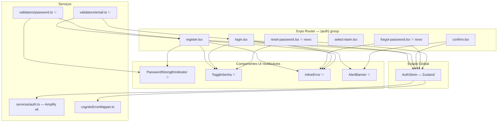
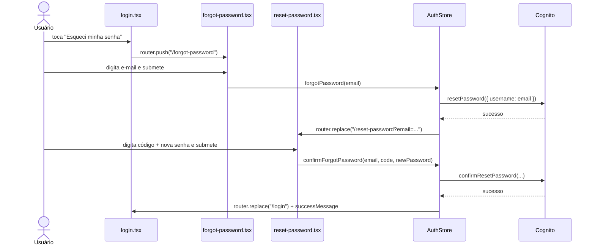
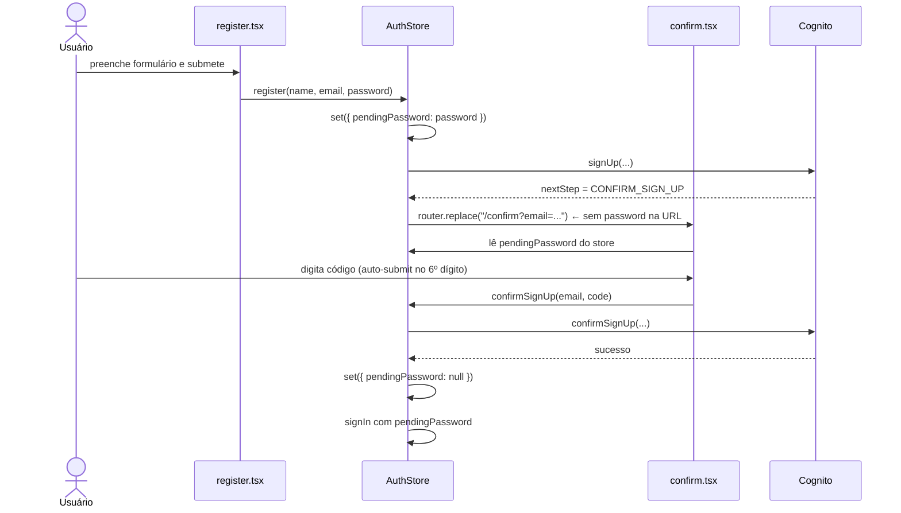

# Design Document — auth-ux-improvement

## Overview

Esta feature melhora a experiência de usuário do fluxo de autenticação do **Sektor Connected Arena** sem alterar o backend (AWS Cognito via Amplify v6). As mudanças são exclusivamente na camada de frontend: novas telas, novos componentes reutilizáveis, extensão do `AuthStore` e correção de uma vulnerabilidade de segurança (senha exposta em URL).

### Escopo das mudanças

| Área | O que muda |
|---|---|
| Telas existentes | `login`, `register`, `confirm`, `select-team` — melhorias incrementais |
| Novas telas | `forgot-password`, `reset-password` |
| Novos componentes | `PasswordStrengthIndicator`, `ToggleSenha`, `InlineError`, `AlertBanner` |
| AuthStore | Novos campos (`pendingPassword`, `resendSuccessMessage`) e novas actions (`forgotPassword`, `resetPassword`) |
| `config.ts` | Campo `description` adicionado à constante `TEAMS` |
| Segurança | Senha removida de parâmetros de URL |

---

## Architecture

O app segue a arquitetura existente: **Expo Router** para navegação baseada em arquivos, **Zustand** para estado global de autenticação, **Amplify v6** como camada de acesso ao Cognito, e **NativeWind** para estilização.



### Fluxo de recuperação de senha (novo)



### Fluxo de registro com senha em memória (corrigido)



---

## Components and Interfaces

### Novos módulos de validação

#### `src/utils/validators/email.ts`

```typescript
/** Padrão RFC 5322 simplificado conforme Requisito 3. */
const EMAIL_REGEX = /^[^\s@]+@[^\s@]+\.[^\s@]+$/;

export function isValidEmail(value: string): boolean {
  return EMAIL_REGEX.test(value);
}
```

#### `src/utils/validators/password.ts`

```typescript
export type PasswordLevel = "fraca" | "razoável" | "boa" | "forte";

export interface PasswordStrength {
  level: PasswordLevel;
  score: number; // 0–3 para uso no indicador visual
}

/**
 * Classifica a senha em quatro níveis mutuamente exclusivos,
 * avaliados em ordem de prioridade decrescente (Requisito 4.2–4.6).
 */
export function getPasswordStrength(password: string): PasswordStrength {
  if (password.length < 8) return { level: "fraca", score: 0 };

  const hasLower = /[a-z]/.test(password);
  const hasUpper = /[A-Z]/.test(password);
  const hasDigit = /\d/.test(password);
  const hasSymbol = /[^a-zA-Z0-9]/.test(password);

  if (password.length >= 12 && hasLower && hasUpper && hasDigit && hasSymbol) {
    return { level: "forte", score: 3 };
  }
  if (hasLower && hasUpper && hasDigit) {
    return { level: "boa", score: 2 };
  }
  if (hasLower && hasDigit) {
    return { level: "razoável", score: 1 };
  }
  return { level: "fraca", score: 0 };
}
```

### Novos componentes UI

#### `src/components/ui/ToggleSenha.tsx`

Props:
- `isVisible: boolean` — estado atual de visibilidade
- `onToggle: () => void` — callback de alternância
- `testID?: string`

Comportamento:
- Renderiza ícone `Eye` (Lucide) quando `isVisible=false`, `EyeOff` quando `isVisible=true`
- `accessibilityLabel`: `"Mostrar senha"` quando oculto, `"Ocultar senha"` quando visível
- Posicionado absolutamente à direita do campo de senha via `View` wrapper

#### `src/components/ui/PasswordStrengthIndicator.tsx`

Props:
- `password: string`

Comportamento:
- Oculto quando `password.length === 0`
- Exibe barra de progresso com 4 segmentos coloridos
- Cores: `#EF4444` (fraca), `#F97316` (razoável), `#EAB308` (boa), `#22C55E` (forte)
- Exibe rótulo textual do nível atual

#### `src/components/ui/InlineError.tsx`

Props:
- `message: string | null`
- `testID?: string`

Comportamento:
- Renderiza `null` quando `message` é `null` ou vazio
- Exibe texto em `text-red-400` com animação `FadeIn` do Reanimated

#### `src/components/ui/AlertBanner.tsx`

Props:
- `message: string | null`
- `type: "error" | "success"`
- `testID?: string`

Comportamento:
- Renderiza `null` quando `message` é `null`
- `type="error"`: fundo `bg-red-900/30`, borda `border-red-500`, texto `text-red-400`
- `type="success"`: fundo `bg-green-900/30`, borda `border-green-500`, texto `text-green-400`
- Posicionado acima do botão de submissão

### Extensão do AuthStore

Novos campos no `AuthState`:

```typescript
/** Senha temporária em memória para o fluxo register → confirm. */
pendingPassword: string | null;

/** Mensagem de sucesso de reenvio de código (distinta de error). */
resendSuccessMessage: string | null;

/** Mensagem de sucesso exibida na tela de login após reset de senha. */
loginSuccessMessage: string | null;
```

Novas actions:

```typescript
forgotPassword: (email: string) => Promise<void>;
confirmForgotPassword: (email: string, code: string, newPassword: string) => Promise<void>;
```

Modificações nas actions existentes:

- `register`: armazena `pendingPassword` no store antes de navegar; remove senha da URL
- `confirmSignUp`: lê `pendingPassword` do store; limpa após sucesso ou 3 falhas consecutivas
- `resendCode`: separa resultado em `resendSuccessMessage` (sucesso) vs `error` (falha)

### Novas telas

#### `src/app/(auth)/forgot-password.tsx`

- Campo de e-mail com `testID="forgot-email-input"` e validação inline via `isValidEmail`
- Botão de submissão com `testID="forgot-submit-button"`, desabilitado durante loading e com e-mail inválido
- Botão "Voltar" que chama `router.back()`
- `AlertBanner` para erros do AuthStore

#### `src/app/(auth)/reset-password.tsx`

- Campo de código com `testID="reset-code-input"`
- Campo de nova senha com `testID="reset-password-input"` e `ToggleSenha`
- Botão de submissão com `testID="reset-submit-button"`, desabilitado durante loading
- Botão "Voltar" que chama `router.back()`
- `AlertBanner` para erros do AuthStore

### Modificações nas telas existentes

#### `login.tsx`
- Adiciona `testID` nos campos e botão (Requisito 12.1–12.2)
- Adiciona link "Esqueci minha senha" com `testID="login-forgot-password-link"`
- Adiciona `ToggleSenha` no campo de senha
- Adiciona validação inline de e-mail via `InlineError`
- Substitui `Text` de erro por `AlertBanner type="error"`
- Exibe `AlertBanner type="success"` quando `loginSuccessMessage` está definido
- Adiciona `returnKeyType="next"` no campo de e-mail e `returnKeyType="done"` no campo de senha
- Usa `useRef` para focar campo de senha via `onSubmitEditing`

#### `register.tsx`
- Adiciona `testID` nos campos e botão (Requisito 12.3–12.4)
- Adiciona campo "Confirmar senha" com `testID="register-confirm-password-input"`
- Adiciona `ToggleSenha` nos campos de senha e confirmação (estados independentes)
- Adiciona `PasswordStrengthIndicator` abaixo do campo de senha
- Adiciona validação inline de e-mail via `InlineError`
- Adiciona validação de coincidência de senhas via `InlineError`
- Atualiza lógica de `canSubmit` para incluir força de senha e coincidência
- Adiciona navegação por teclado: nome → e-mail → senha → confirmação
- Substitui `Text` de erro por `AlertBanner type="error"`

#### `confirm.tsx`
- Remove leitura de `password` de `useLocalSearchParams`
- Lê `pendingPassword` do `AuthStore`
- Adiciona auto-submit quando `code.length === 6`
- Adiciona `Cooldown_Reenvio`: timer de 60s após reenvio bem-sucedido
- Exibe `AlertBanner type="success"` para `resendSuccessMessage` (separado do erro)
- Adiciona texto "O código expira em 24 horas"
- Lógica de `ExpiredCodeException`: habilita botão de reenvio mesmo com cooldown ativo

#### `select-team.tsx`
- Adiciona logo placeholder (ícone genérico via `@expo/vector-icons`)
- Adiciona exibição de `description` de cada time
- Adiciona indicador visual de seleção imediata (estado local `selectedId` antes da chamada async)
- Aplica `team.color` como cor de borda do card

---

## Data Models

### Extensão de `TEAMS` em `config.ts`

```typescript
export const TEAMS = [
  {
    id: "team-a",
    name: "Time A",
    color: "#E63946",
    description: "Os guerreiros do setor vermelho. Paixão e garra em cada partida.",
  },
  {
    id: "team-b",
    name: "Time B",
    color: "#1D3557",
    description: "A força do setor azul. Tradição e estratégia no DNA do clube.",
  },
] as const;
```

### Extensão do tipo `AuthState`

```typescript
export interface AuthState {
  // ... campos existentes ...
  pendingPassword: string | null;
  resendSuccessMessage: string | null;
  loginSuccessMessage: string | null;
  forgotPassword: (email: string) => Promise<void>;
  confirmForgotPassword: (email: string, code: string, newPassword: string) => Promise<void>;
}
```

### Hook `useCooldown`

```typescript
// src/hooks/useCooldown.ts
export function useCooldown(durationSeconds: number) {
  const [remaining, setRemaining] = useState(0);
  const isActive = remaining > 0;

  const start = useCallback(() => {
    setRemaining(durationSeconds);
  }, [durationSeconds]);

  useEffect(() => {
    if (!isActive) return;
    const id = setInterval(() => {
      setRemaining((r) => Math.max(0, r - 1));
    }, 1000);
    return () => clearInterval(id);
  }, [isActive]);

  return { remaining, isActive, start };
}
```

---

## Correctness Properties

*A property is a characteristic or behavior that should hold true across all valid executions of a system — essentially, a formal statement about what the system should do. Properties serve as the bridge between human-readable specifications and machine-verifiable correctness guarantees.*

### Property 1: Validador_Email — Classificação correta de e-mails válidos

*Para qualquer* string que satisfaz o padrão `^[^\s@]+@[^\s@]+\.[^\s@]+$`, `isValidEmail(s)` deve retornar `true`.

**Validates: Requirements 3.4**

---

### Property 2: Validador_Email — Classificação correta de e-mails inválidos

*Para qualquer* string que não satisfaz o padrão `^[^\s@]+@[^\s@]+\.[^\s@]+$` (sem `@`, sem domínio, com espaços), `isValidEmail(s)` deve retornar `false`.

**Validates: Requirements 3.5**

---

### Property 3: Validador_Senha — Exclusividade mútua dos níveis

*Para qualquer* string de senha, `getPasswordStrength(password).level` deve retornar exatamente um dos valores `"fraca" | "razoável" | "boa" | "forte"`, e os critérios de classificação são mutuamente exclusivos.

**Validates: Requirements 4.2, 4.3, 4.4, 4.5, 4.6**

---

### Property 4: Validador_Senha — Monotonicidade da força

*Para qualquer* senha `p` e qualquer caractere adicional `c`, `getPasswordStrength(p + c).score >= getPasswordStrength(p).score` — adicionar caracteres nunca reduz a força classificada.

**Validates: Requirements 4.2**

---

### Property 5: PasswordStrengthIndicator — Renderização consistente com o nível

*Para qualquer* senha não vazia, o `PasswordStrengthIndicator` deve exibir a cor e o rótulo textual correspondentes ao nível retornado por `getPasswordStrength(password)`.

**Validates: Requirements 4.7, 4.8**

---

### Property 6: Senha nunca aparece em URLs de rota

*Para qualquer* combinação de e-mail e senha no fluxo de registro, nenhuma URL de navegação gerada pelo `AuthStore` deve conter a senha como parâmetro de rota.

**Validates: Requirements 7.1, 7.2, 7.6**

---

### Property 7: pendingPassword é limpo após uso ou abandono

*Para qualquer* fluxo de registro, após `confirmSignUp` ser chamado com sucesso, ou após 3 falhas consecutivas para o mesmo e-mail, ou após o usuário navegar para fora da `Tela_Confirmacao`, `AuthStore.pendingPassword` deve ser `null`.

**Validates: Requirements 7.4, 7.5, 7.7**

---

### Property 8: Auto-submit acionado exatamente para 6 dígitos numéricos

*Para qualquer* string de exatamente 6 caracteres numéricos inserida no campo de código, `confirmSignUp` deve ser chamado automaticamente. *Para qualquer* string que não seja exatamente 6 dígitos numéricos, `confirmSignUp` não deve ser chamado automaticamente.

**Validates: Requirements 9.1, 9.4**

---

### Property 9: Cooldown exibe texto correto para qualquer valor de tempo restante

*Para qualquer* valor de segundos restantes `r` no intervalo `[1, 60]`, o botão "Reenviar código" deve estar desabilitado e exibir o texto `"Reenviar em ${r}s"`.

**Validates: Requirements 8.3**

---

### Property 10: Mensagens de sucesso e erro nunca são exibidas simultaneamente

*Para qualquer* estado da `Tela_Confirmacao`, o `AlertBanner type="success"` e o `AlertBanner type="error"` nunca devem estar visíveis ao mesmo tempo.

**Validates: Requirements 8.5**

---

### Property 11: testIDs obrigatórios presentes em cada tela de autenticação

*Para qualquer* renderização de cada tela de autenticação, todos os `testID`s listados nos Requisitos 12.1–12.6 devem estar presentes e ser únicos dentro da tela.

**Validates: Requirements 12.1, 12.2, 12.3, 12.4, 12.5, 12.6, 12.7**

---

### Property 12: Botão de submissão desabilitado durante loading

*Para qualquer* tela de autenticação com um botão de submissão, enquanto `isLoading=true` no `AuthStore`, o botão de submissão deve estar desabilitado.

**Validates: Requirements 1.10, 1.3, 1.5**

---

## Error Handling

### Mapeamento de erros do Cognito

O `cognitoErrorMapper` existente já cobre os principais erros. Para a feature de recuperação de senha, os seguintes erros são relevantes e já estão mapeados:

| Erro Cognito | Mensagem exibida |
|---|---|
| `CodeMismatchException` | "Código incorreto. Verifique e tente novamente." |
| `ExpiredCodeException` | "Código expirado. Solicite um novo código." |
| `LimitExceededException` | "Muitas tentativas. Aguarde alguns minutos e tente novamente." |
| `InvalidPasswordException` | "A senha não atende aos requisitos mínimos." |
| `UserNotFoundException` | "Usuário não encontrado." |

### Comportamento de erro por tela

**`forgot-password.tsx`**:
- Erros do Cognito → `AlertBanner type="error"` acima do botão
- Sem navegação em caso de erro
- Botão reabilitado após erro

**`reset-password.tsx`**:
- Erros do Cognito → `AlertBanner type="error"` acima do botão
- Usuário permanece na tela
- Botão reabilitado após erro

**`confirm.tsx`**:
- `ExpiredCodeException` → exibe mensagem mapeada E habilita botão de reenvio (ignora cooldown ativo)
- Outros erros → `AlertBanner type="error"`, campo de código reabilitado com dígitos preservados
- Após 3 falhas consecutivas → `pendingPassword` limpo

### Limpeza de estado de erro

Seguindo o padrão existente no codebase, `AuthStore.error` é limpo:
- No início de cada nova operação (`set({ error: null })`)
- Quando o usuário começa a editar qualquer campo (Requisito 11.5)
- `resendSuccessMessage` e `loginSuccessMessage` são limpos no início da próxima operação relevante

---

## Testing Strategy

### Abordagem dual

A estratégia combina testes de exemplo (para comportamentos específicos e fluxos de UI) com testes baseados em propriedades (para lógica pura dos validadores e invariantes de estado).

### Biblioteca de property-based testing

**`fast-check`** — biblioteca madura para JavaScript/TypeScript, compatível com Jest.

```bash
npm install --save-dev fast-check
```

Cada teste de propriedade deve rodar com mínimo de **100 iterações** (padrão do fast-check).

### Estrutura de arquivos de teste

```
src/
  utils/
    validators/
      __tests__/
        email.test.ts        ← testes de propriedade (P1, P2)
        password.test.ts     ← testes de propriedade (P3, P4)
  components/
    ui/
      __tests__/
        PasswordStrengthIndicator.test.tsx  ← testes de propriedade (P5)
        ToggleSenha.test.tsx                ← testes de exemplo
        AlertBanner.test.tsx                ← testes de exemplo
  store/
    __tests__/
      authStore.test.ts      ← testes de propriedade (P6, P7, P12)
  app/
    (auth)/
      __tests__/
        confirm.test.tsx     ← testes de propriedade (P8, P9, P10, P11)
        login.test.tsx        ← testes de exemplo + P11
        register.test.tsx     ← testes de exemplo + P11
        forgot-password.test.tsx  ← testes de exemplo + P11
        reset-password.test.tsx   ← testes de exemplo + P11
```

### Testes de propriedade (fast-check)

Cada propriedade do design é implementada como um único teste de propriedade:

```typescript
// Exemplo — Property 1: Validador_Email válidos
// Feature: auth-ux-improvement, Property 1: isValidEmail returns true for valid emails
it("isValidEmail retorna true para qualquer e-mail válido", () => {
  fc.assert(
    fc.property(
      fc.emailAddress(), // gerador de e-mails válidos do fast-check
      (email) => {
        expect(isValidEmail(email)).toBe(true);
      }
    ),
    { numRuns: 100 }
  );
});
```

```typescript
// Exemplo — Property 3: Validador_Senha exclusividade mútua
// Feature: auth-ux-improvement, Property 3: getPasswordStrength returns exactly one level
it("getPasswordStrength retorna exatamente um nível para qualquer senha", () => {
  const LEVELS: PasswordLevel[] = ["fraca", "razoável", "boa", "forte"];
  fc.assert(
    fc.property(fc.string(), (password) => {
      const { level } = getPasswordStrength(password);
      expect(LEVELS).toContain(level);
    }),
    { numRuns: 100 }
  );
});
```

### Testes de exemplo (Jest + @testing-library/react-native)

Focados em:
- Fluxos de navegação (login → forgot-password → reset-password → login)
- Interações de UI específicas (toggle de senha, auto-submit, cooldown)
- Integração entre componentes e AuthStore (mockado)
- Verificação de `testID`s obrigatórios

### Cobertura mínima esperada

| Módulo | Tipo de teste | Propriedades cobertas |
|---|---|---|
| `validators/email.ts` | Propriedade | P1, P2 |
| `validators/password.ts` | Propriedade | P3, P4 |
| `PasswordStrengthIndicator` | Propriedade | P5 |
| `AuthStore` (register/confirm) | Propriedade | P6, P7, P12 |
| `confirm.tsx` | Propriedade + Exemplo | P8, P9, P10, P11 |
| `login.tsx` | Exemplo | P11, fluxos de navegação |
| `register.tsx` | Exemplo | P11, validação inline |
| `forgot-password.tsx` | Exemplo | P11, fluxo de recuperação |
| `reset-password.tsx` | Exemplo | P11, fluxo de redefinição |
