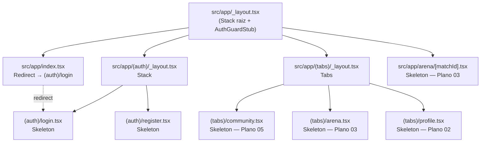

# Design Document — Plano 01 — Fundação

## Overview

O Plano 01 entrega a **fundação estrutural** do App Sektor (React Native + Expo). O design não introduz lógica de domínio, estado global real ou efeitos colaterais. Em vez disso, define:

- a árvore de pastas de `src/` que os Planos 02 a 06 vão consumir,
- a topologia de rotas do Expo Router (grupos `(auth)` e `(tabs)` + rota dinâmica `arena/[matchId]`),
- os 7 tipos centrais do domínio em `src/types/index.ts`,
- as constantes de configuração em `src/constants/config.ts`,
- stubs tipados em `src/services/`, `src/hooks/` e `src/store/` que falham de forma previsível ao serem invocados,
- a configuração mínima de NativeWind/Tailwind/Babel/Metro compatível com Expo SDK 54 e React Native Reanimated 4.

O princípio condutor é o mesmo de `docs/plano-01-fundacao.md`: **criar apenas o que os planos seguintes vão usar**. Toda a tela renderizável neste plano é uma View+Text com `className` NativeWind, identificando o nome da tela e o plano que a implementará de fato.

O critério de sucesso é objetivo:

1. `tsc --noEmit` retorna código de saída zero (Requirement 9).
2. O bundler do Expo inicia o App e renderiza a tela de login skeleton (Requirement 10).
3. Navegação entre as três abas e para `arena/<qualquer-string>` ocorre sem exceções (Requirement 3, Requirement 10).

Este plano não bloqueia decisões futuras: nenhum acoplamento a Zustand, AWS Amplify, expo-location, lucide ou Reanimated é introduzido aqui — apenas a configuração de build necessária para que esses pacotes funcionem nos próximos planos.

## Architecture

### Camadas

A fundação é organizada em quatro camadas, todas inertes neste plano:

| Camada | Pasta | Estado neste plano |
|---|---|---|
| Roteamento | `src/app/` | Rotas reais, layouts mínimos, telas skeleton |
| Componentes UI | `src/components/{arena,community,ui}/` | Vazio (`.gitkeep`) |
| Domínio (tipos + config) | `src/types/`, `src/constants/` | Implementado |
| Serviços / Hooks / Store | `src/services/`, `src/hooks/`, `src/store/` | Stubs tipados que lançam `Error` ao serem invocados |

A direção de dependências respeita a hierarquia: `app → components → hooks → services / store → types / constants`. Neste plano só os nós `app`, `types`, `constants` e os stubs em `services/hooks/store` são exercitados.

### Topologia de Rotas (Expo Router)



**Decisões de design:**

- `_layout.tsx` raiz usa `<Stack />` para que os grupos `(auth)`, `(tabs)` e a rota `arena/[matchId]` sejam apresentados como telas Stack independentes (em vez de `<Slot />`). Isso permite, no Plano 03, abrir `arena/[matchId]` empilhada por cima das tabs sem reescrever este layout.
- `index.tsx` deixa de ser uma tela visual e passa a fazer apenas `<Redirect href="/(auth)/login" />`. Esse redirecionamento é o **Auth Guard Stub** deste plano (Requirement 2.4). A lógica real de "se autenticado vai para (tabs), senão vai para (auth)" entra no Plano 02.
- `(auth)/_layout.tsx` é um `Stack` simples (sem header customizado) — basta para login/register skeleton.
- `(tabs)/_layout.tsx` é um `Tabs` com exatamente três `<Tabs.Screen>`: `community`, `arena`, `profile` (Requirement 3.1). Ícones e estilização ficam para o Plano 06.
- A rota `arena/[matchId]` está **fora** do grupo `(tabs)`. Isso reflete o fluxo do Plano 03: ao entrar em uma partida, o usuário sai do contexto de tabs e vai para a experiência imersiva da Arena.

### Compatibilidade com `typedRoutes` e `reactCompiler`

`app.json` já habilita `experiments.typedRoutes: true` e `experiments.reactCompiler: true`. Isso significa que:

- `<Redirect href="/(auth)/login" />` precisa usar uma rota tipada que o Expo Router gere em `.expo/types/router.d.ts` — após criar os arquivos de rota, basta rodar `expo start` uma vez para regenerar os tipos.
- O React Compiler vai analisar os componentes skeleton; como eles não têm hooks ou closures, são triviais para o compiler — não há risco de hooks instáveis neste plano.

## Components and Interfaces

### Estrutura de Pastas Final

```
src/
├── app/
│   ├── _layout.tsx              ← Stack raiz
│   ├── index.tsx                ← Redirect → (auth)/login
│   ├── (auth)/
│   │   ├── _layout.tsx          ← Stack
│   │   ├── login.tsx            ← Skeleton — Plano 02
│   │   └── register.tsx         ← Skeleton — Plano 02
│   ├── (tabs)/
│   │   ├── _layout.tsx          ← Tabs
│   │   ├── community.tsx        ← Skeleton — Plano 05
│   │   ├── arena.tsx            ← Skeleton — Plano 03
│   │   └── profile.tsx          ← Skeleton — Plano 02
│   └── arena/
│       └── [matchId].tsx        ← Skeleton — Plano 03
│
├── components/
│   ├── arena/.gitkeep
│   ├── community/.gitkeep
│   └── ui/.gitkeep
│
├── services/
│   ├── api.ts                   ← Stub
│   ├── websocket.ts             ← Stub
│   ├── auth.ts                  ← Stub
│   └── matchSimulator.ts        ← Stub
│
├── hooks/
│   ├── useArena.ts              ← Stub
│   ├── useWebSocket.ts          ← Stub
│   └── useCommunity.ts          ← Stub
│
├── store/
│   ├── arenaStore.ts            ← Stub
│   └── authStore.ts             ← Stub
│
├── types/
│   └── index.ts
│
├── constants/
│   └── config.ts
│
└── global.css
```

Os arquivos `src/app/index.tsx`, `src/app/_layout.tsx`, `src/components/{arena,community,ui}/.gitkeep`, `src/services/.gitkeep` e `src/global.css` já existem parcialmente no repositório e serão substituídos / consolidados pelos arquivos finais descritos abaixo.

### Layout Raiz e Auth Guard Stub

`src/app/_layout.tsx` é um `Stack` mínimo que delega navegação aos filhos. Ele **não** verifica sessão neste plano — a verificação real entra no Plano 02 e dependerá de `authStore`. Aqui o "guard" é uma simples decisão estática: a rota raiz redireciona para login.

```tsx
// src/app/_layout.tsx (pseudocódigo)
import { Stack } from "expo-router";
import "../global.css"; // garante carga do bundle Tailwind

export default function RootLayout() {
  return (
    <Stack screenOptions={{ headerShown: false }}>
      <Stack.Screen name="(auth)" />
      <Stack.Screen name="(tabs)" />
      <Stack.Screen name="arena/[matchId]" />
    </Stack>
  );
}
```

```tsx
// src/app/index.tsx (pseudocódigo)
import { Redirect } from "expo-router";

export default function Index() {
  // Auth Guard Stub: Plano 02 substituirá por lógica baseada em authStore.
  return <Redirect href="/(auth)/login" />;
}
```

**Por que `Redirect` e não `useEffect` + `router.replace`:** `Redirect` é declarativo, executa antes do primeiro frame, evita "flash" da tela index e não depende de hooks de efeito — alinhado com a decisão de evitar lógica neste plano (Requirement 4.4 estende implicitamente o princípio).

### Layout de Tabs

```tsx
// src/app/(tabs)/_layout.tsx (pseudocódigo)
import { Tabs } from "expo-router";

export default function TabsLayout() {
  return (
    <Tabs screenOptions={{ headerShown: false }}>
      <Tabs.Screen name="community" options={{ title: "Comunidade" }} />
      <Tabs.Screen name="arena" options={{ title: "Arena" }} />
      <Tabs.Screen name="profile" options={{ title: "Perfil" }} />
    </Tabs>
  );
}
```

A ordem dos `<Tabs.Screen>` define a ordem visual da Tab Bar (Requirement 3.1). Ícones e badges ficam para o Plano 06.

### Layout de Auth

```tsx
// src/app/(auth)/_layout.tsx (pseudocódigo)
import { Stack } from "expo-router";

export default function AuthLayout() {
  return <Stack screenOptions={{ headerShown: false }} />;
}
```

### Padrão de Tela Skeleton

Toda tela criada neste plano segue exatamente este shape:

```tsx
// Padrão para qualquer skeleton
import { Text, View } from "react-native";

export default function NomeDaTelaScreen() {
  return (
    <View className="flex-1 items-center justify-center bg-white">
      <Text className="text-lg font-bold">Título da Tela</Text>
      <Text className="text-gray-500">Plano XX</Text>
    </View>
  );
}
```

Mapeamento por arquivo:

| Arquivo | Título | Rótulo de plano |
|---|---|---|
| `(auth)/login.tsx` | "Login" | "Plano 02" |
| `(auth)/register.tsx` | "Cadastro" | "Plano 02" |
| `(tabs)/community.tsx` | "Comunidade" | "Plano 05" |
| `(tabs)/arena.tsx` | "Arena" | "Plano 03" |
| `(tabs)/profile.tsx` | "Perfil" | "Plano 02" |
| `arena/[matchId].tsx` | "Partida {matchId}" | "Plano 03" |

A tela de partida usa `useLocalSearchParams<{ matchId: string }>()` apenas para renderizar o `matchId` no título. Não há outra lógica.

**Restrições reforçadas (Requirement 4):**

- Apenas `View` e `Text` de `react-native`.
- Sem `import` de `src/services/`, `src/hooks/` ou `src/store/`.
- Estilização exclusivamente via `className` NativeWind (sem `StyleSheet`).

### Padrão de Stub Tipado

Cada arquivo em `src/services/`, `src/hooks/` e `src/store/` exporta assinaturas tipadas e usa um helper interno comum para falhar de forma previsível quando invocado (Requirement 7.2 e 7.3).

```ts
// padrão interno (não exportado)
function stubBoom(fnName: string, plano: string): never {
  // Em runtime hostis (testes, snapshots) o throw pode ser engolido.
  // Per Requirement 7.3, isto é aceitável: o objetivo é sinalizar uso indevido.
  throw new Error(
    `[stub:${fnName}] ainda não implementado — responsável: ${plano}`
  );
}
```

**Services** (`src/services/*.ts`):

```ts
// src/services/api.ts (pseudocódigo)
import type { Post, Comment, Match, Prediction } from "../types";

export function getFeed(): Promise<Post[]> {
  return stubBoom("api.getFeed", "Plano 05");
}
export function getMatch(id: string): Promise<Match> {
  return stubBoom("api.getMatch", "Plano 03");
}
// ...assinaturas adicionais consumidas pelos planos seguintes
```

```ts
// src/services/websocket.ts → Plano 03 / 04
// src/services/auth.ts      → Plano 02
// src/services/matchSimulator.ts → Plano 04
```

**Hooks** (`src/hooks/*.ts`) — o tipo de retorno é explícito (Requirement 7.4):

```ts
// src/hooks/useArena.ts (pseudocódigo)
import type { Match, PressureBarState } from "../types";

export interface UseArenaResult {
  match: Match | null;
  pressure: PressureBarState;
  loading: boolean;
}

export function useArena(matchId: string): UseArenaResult {
  return stubBoom("useArena", "Plano 03");
}
```

```ts
// src/hooks/useWebSocket.ts → Plano 03
// src/hooks/useCommunity.ts → Plano 05
```

**Stores** (`src/store/*.ts`) — exportam estado + ações tipados, **sem dependência de Zustand** neste plano (Requirement 7.5):

```ts
// src/store/authStore.ts (pseudocódigo)
import type { User } from "../types";

export interface AuthState {
  user: User | null;
  isAuthenticated: boolean;
  signIn(email: string, password: string): Promise<void>;
  signOut(): Promise<void>;
}

export function useAuthStore(): AuthState {
  return stubBoom("useAuthStore", "Plano 02");
}
```

```ts
// src/store/arenaStore.ts (pseudocódigo)
import type { Match, Prediction, PressureBarState } from "../types";

export interface ArenaState {
  match: Match | null;
  predictions: Prediction[];
  pressure: PressureBarState;
  setMatch(match: Match): void;
  applyPressure(next: PressureBarState): void;
}

export function useArenaStore(): ArenaState {
  return stubBoom("useArenaStore", "Plano 03");
}
```

**Por que `useAuthStore` é uma função e não um objeto Zustand:** o Plano 02 vai trocar a implementação por `create<AuthState>()(...)`. A assinatura `() => AuthState` é compatível com o que Zustand expõe, então a substituição é mecânica e não exige refactor das chamadas dos planos posteriores. Aqui isso é apenas uma função tipada — sem importar Zustand neste plano.

### Configuração NativeWind / Babel / Metro

#### `tailwind.config.js` (raiz)

```js
/** @type {import('tailwindcss').Config} */
module.exports = {
  content: ["./src/**/*.{js,jsx,ts,tsx}"],
  presets: [require("nativewind/preset")],
  theme: { extend: {} },
  plugins: [],
};
```

- `content` aponta exclusivamente para `src/**` (Requirement 8.1) — coerente com a convenção de o App viver em `src/`.
- `presets` carrega o preset NativeWind v4 (Requirement 8.2). NativeWind 4.2.x roda sobre Tailwind 3.4.x, que é a versão presente em `package.json`.

#### `babel.config.js` (raiz)

```js
module.exports = function (api) {
  api.cache(true);
  return {
    presets: [
      ["babel-preset-expo", { jsxImportSource: "nativewind" }],
      "nativewind/babel",
    ],
    plugins: ["react-native-worklets/plugin"],
  };
};
```

- `jsxImportSource: 'nativewind'` é o que faz `className` funcionar nas telas (Requirement 8.4).
- `nativewind/babel` é exigido pelo NativeWind v4 para transformar utilitários.
- `react-native-worklets/plugin` substitui o antigo `react-native-reanimated/plugin` a partir do Reanimated 4 (presente como `react-native-reanimated@~4.1.1` + `react-native-worklets@0.5.1`). **Deve ser o último plugin da lista.** Sem ele, qualquer worklet usado nos Planos 03/06 quebra em build nativa, e o babel pode emitir aviso na inicialização.

#### `metro.config.js` (raiz)

```js
const { getDefaultConfig } = require("expo/metro-config");
const { withNativeWind } = require("nativewind/metro");

const config = getDefaultConfig(__dirname);

module.exports = withNativeWind(config, {
  input: "./src/global.css",
});
```

- `getDefaultConfig` parte da configuração do Expo (suporta `newArchEnabled: true` já presente em `app.json`).
- `withNativeWind({ input: './src/global.css' })` é o que conecta o CSS com diretivas Tailwind ao runtime do NativeWind (Requirement 8.5).

#### `src/global.css`

```css
@tailwind base;
@tailwind components;
@tailwind utilities;
```

O `@layer base { :root { ... } }` atualmente presente em `src/global.css` é mantido vazio por enquanto (sem custom properties) — variáveis de design entram no Plano 06. Manter o bloco vazio é inofensivo para o build.

### Critérios de Validação Locais

Após implementar todos os arquivos, dois comandos validam a fundação:

1. **Type-check** — `npx tsc --noEmit` na raiz do App. Deve sair com código `0` e zero erros.
2. **Bundling** — `npx expo start --no-dev --minify` (ou `npx expo export -p web`) deve concluir sem erros nem warnings de NativeWind/Babel/Metro. Em desenvolvimento, `npx expo start` deve abrir o bundler, e o app simulado/web deve renderizar a tela de login skeleton.

Não há suíte de testes automatizada neste plano. As validações são manuais e binárias (passa / não passa).

## Data Models

### Tipos Centrais (`src/types/index.ts`)

Estas são as 7 entidades que os Planos 02 a 06 vão importar. As assinaturas são copiadas literalmente de `docs/plano-01-fundacao.md` para evitar deriva.

```ts
export type TeamId = string;

export interface User {
  id: string;
  email: string;
  name: string;
  teamId: TeamId;
}

export interface Post {
  id: string;
  authorId: string;
  authorName: string;
  teamId: TeamId;
  text: string;
  imageUrl?: string;
  likes: number;
  commentCount: number;
  createdAt: string;
}

export interface Comment {
  id: string;
  postId: string;
  authorId: string;
  authorName: string;
  text: string;
  createdAt: string;
}

export interface Match {
  id: string;
  teamA: { id: TeamId; name: string; color: string };
  teamB: { id: TeamId; name: string; color: string };
  minute: number;
  status: "upcoming" | "live" | "finished";
}

export interface Prediction {
  id: string;
  matchId: string;
  question: string;
  options: string[];
  correctOption?: number;
  expiresAt: string;
}

export interface PressureBarState {
  teamA: number; // 0–100
  teamB: number; // 0–100
}
```

**Como cada plano consome estes tipos:**

| Tipo | Consumido por | Uso |
|---|---|---|
| `User` | Plano 02 (`authStore`), Plano 05 (autoria de Posts) | Identificar usuário autenticado |
| `Post`, `Comment` | Plano 05 (`useCommunity`, telas de feed) | Feed da comunidade |
| `Match` | Plano 03 (Arena), Plano 04 (Simulador) | Estado da partida |
| `Prediction` | Plano 03 (palpites), Plano 04 (geração) | Palpites em tempo real |
| `PressureBarState` | Plano 03 (UI de pressão), Plano 04 (simulação) | Barra de pressão |
| `TeamId` | Todos | Alias semântico para identificadores de time |

Datas são strings ISO 8601 deliberadamente — evita decidir entre `Date`, `number` (epoch) ou bibliotecas de data antes de ser necessário (Plano 05).

### Constantes de Configuração (`src/constants/config.ts`)

```ts
export const AWS_REGION = "us-east-1";

export const API_REST_URL =
  process.env.EXPO_PUBLIC_API_REST_URL ??
  "https://PLACEHOLDER.execute-api.us-east-1.amazonaws.com/prod";

export const API_WS_URL =
  process.env.EXPO_PUBLIC_API_WS_URL ??
  "wss://PLACEHOLDER.execute-api.us-east-1.amazonaws.com/prod";

export const STADIUM_COORDS = {
  latitude: -23.5505,
  longitude: -46.6333,
  radiusMeters: 500,
};

export const TEAMS = [
  { id: "team-a", name: "Time A", color: "#E63946" },
  { id: "team-b", name: "Time B", color: "#1D3557" },
] as const;
```

**Estratégia de fallback (`EXPO_PUBLIC_*`):**

- Variáveis com prefixo `EXPO_PUBLIC_` são inlinadas em build pelo Expo CLI. Quando a variável existe (`.env`, CI, EAS), `process.env.EXPO_PUBLIC_API_REST_URL` é a string real; quando não existe, o `??` retorna o placeholder.
- O placeholder começa com `https://PLACEHOLDER` / `wss://PLACEHOLDER` propositalmente: qualquer chamada real feita acima dele falhará com erro de resolução DNS, e o usuário (dev) perceberá imediatamente que esqueceu de configurar a env. Para este plano, nenhum stub faz chamada real, então o placeholder nunca é exercitado.

**`STADIUM_COORDS`:** valores temporários (Praça da Sé, São Paulo). O Plano 06 substitui pelas coordenadas reais. O formato é fixo (`{ latitude, longitude, radiusMeters }`) — esse formato é o que o Plano 06 vai consumir em `expo-location`.

**`TEAMS as const`:** o `as const` é deliberado — permite que o Plano 03 derive o tipo dos IDs como `(typeof TEAMS)[number]['id']` se quiser strings literais em vez de `TeamId = string`. O array tem exatamente dois elementos para a fase atual (clássico de duas partes); expansão para múltiplos times é responsabilidade de planos futuros.


## Correctness Properties

*Uma propriedade é uma característica ou comportamento que deve permanecer verdadeiro em todas as execuções válidas do sistema — uma afirmação formal sobre o que o software deve fazer. Propriedades servem de ponte entre especificações em linguagem natural e garantias de correção verificáveis por máquina.*

### Aplicabilidade de PBT a este Plano

Este plano é exclusivamente estrutural — não há lógica de domínio, transformação de dados, parser/serializer ou estado dinâmico. A maior parte dos requisitos é coberta por:

- `tsc --noEmit` (Requirements 5, 6, 7.1, 7.4, 9) — type-checker garante export de tipos, campos, e tipos de retorno.
- Validação manual no bundler do Expo (Requirements 3, 8.6, 10) — comportamento end-to-end visual.
- Inspeção de arquivos de configuração (Requirement 8) — configuração one-shot.

Mesmo assim, há um pequeno conjunto de **propriedades estruturais** que vale formalizar agora: elas são verificáveis por análise estática + invocação simples e estabelecem o contrato que o Plano 02 vai expandir quando montar a primeira suíte real de PBT. **Não criamos suíte de testes neste plano** — apenas documentamos as propriedades e deixamos a base preparada.

### Property 1: Route Files Are Well-Formed

*For all* arquivos de rota na lista canônica do plano (`src/app/_layout.tsx`, `src/app/index.tsx`, `src/app/(auth)/_layout.tsx`, `src/app/(auth)/login.tsx`, `src/app/(auth)/register.tsx`, `src/app/(tabs)/_layout.tsx`, `src/app/(tabs)/community.tsx`, `src/app/(tabs)/arena.tsx`, `src/app/(tabs)/profile.tsx`, `src/app/arena/[matchId].tsx`), o arquivo existe no filesystem, exporta um `default function` React, e — para arquivos que **não** são `_layout` nem `index`/`Redirect` — o conteúdo JSX renderizado contém uma referência textual do tipo `Plano \d+`.

**Validates: Requirements 1.1, 1.2, 1.3, 2.1, 2.2, 2.3, 4.1, 4.3**

### Property 2: Skeleton Import Discipline

*For all* arquivo de tela skeleton (`src/app/(auth)/login.tsx`, `src/app/(auth)/register.tsx`, `src/app/(tabs)/community.tsx`, `src/app/(tabs)/arena.tsx`, `src/app/(tabs)/profile.tsx`, `src/app/arena/[matchId].tsx`), os imports do arquivo satisfazem simultaneamente as três restrições: (a) o conjunto de símbolos importados de `react-native` é subconjunto de `{View, Text}` (com a única exceção de `useLocalSearchParams` em `[matchId].tsx`, que vem de `expo-router`); (b) nenhum import resolve para `../services`, `../hooks` ou `../store`; (c) `StyleSheet` não está entre os símbolos importados de `react-native`.

**Validates: Requirements 4.2, 4.4, 4.5**

### Property 3: Stub Invocation Fails Loudly

*For all* função pública exportada por qualquer módulo em `src/services/`, `src/hooks/` ou `src/store/`, invocá-la diretamente (com argumentos válidos pelo tipo) lança um `Error` cuja mensagem contém **tanto** o nome da função **quanto** o token `Plano` seguido de um número, identificando o plano responsável pela implementação real.

**Validates: Requirements 7.3**

### Notas sobre as Propriedades

- **Propriedade 1** é primariamente verificável por análise estática (existência de arquivo + AST/regex sobre o conteúdo). Não requer renderização nem framework de testes.
- **Propriedade 2** também é verificável por análise estática dos imports de cada arquivo skeleton. Útil como guard-rail para que os Planos 02 a 06 não introduzam lógica nas telas-skeleton acidentalmente.
- **Propriedade 3** é a mais comportamental: requer apenas executar a função e capturar o `Error`. Pode ser implementada como uma única função paramétrica sobre `[moduleName, functionName, expectedPlanoTag]`.
- Propriedades sobre fallback de `EXPO_PUBLIC_*` (Requirement 6.2 e 6.3) são naturalmente PBT (variar `process.env`, asserir resultado) mas dependem de ambiente de teste configurado — **deferido para o Plano 02**.

## Error Handling

A fundação adota uma estratégia de "falhar cedo, falhar com mensagem clara" — adequada a um plano cuja maior promessa é exatamente **não fazer nada** acidentalmente.

| Categoria de erro | Estratégia | Onde |
|---|---|---|
| Rota ausente | Erro de build do Expo Router (delegado à ferramenta) | `expo start` reporta automaticamente |
| Tipo incorreto / símbolo inexistente | Erro de compilação do TypeScript (delegado à ferramenta) | `tsc --noEmit` reporta |
| Invocação de stub | `Error` lançado via `stubBoom(fnName, plano)` com mensagem identificando função + plano (Requirement 7.3) | Cada arquivo em `services/`, `hooks/`, `store/` |
| Variável de ambiente ausente | Fallback para placeholder visível em URL (`PLACEHOLDER`) — qualquer chamada real falhará com DNS error óbvio | `src/constants/config.ts` |
| Render de skeleton | Sem possibilidade real de erro: View+Text com strings literais é trivial. Erros aqui só acontecem se houver bug de bundling — coberto por `expo start` | Skeletons |
| Invocação de stub em runtime do React (durante render) | Per Requirement 7.3, se o `throw` em si falhar por motivos de runtime, o stub PODE retornar silenciosamente; isso é aceito como degradação tolerável e nunca acontece se o JS engine estiver íntegro | Stubs |

**Não há blocos `try/catch` neste plano.** O `Error` lançado por `stubBoom` é intencionalmente não capturado — é um sinal de "código de plano futuro foi invocado por engano". O Plano 02 vai substituir cada `stubBoom` por implementação real, e o erro deixa de existir naturalmente.

**Sem error boundaries customizados.** O Expo Router já fornece error overlay em desenvolvimento; isso é suficiente para a fase de fundação. Error boundaries específicos de produto entram nos planos seguintes conforme precisarem.

## Testing Strategy

### Avaliação: PBT é Apropriado para Este Plano?

**Resposta: parcialmente — apenas para 3 propriedades estruturais documentadas acima.**

A maior parte do que este plano entrega cai em categorias onde PBT **não** é a ferramenta certa:

- **Configuração de build** (Requirement 8): one-shot. Validado por inspeção de arquivos e por `expo start` rodar sem warnings. Snapshot/integração, não PBT.
- **Type definitions** (Requirements 5, 6, 7.1, 7.4): cobertos pelo próprio compilador TypeScript. PBT seria redundante.
- **Navegação Expo Router** (Requirements 2, 3, 10): comportamento de terceiro (Expo Router). PBT testaria a biblioteca, não nosso código.
- **Renderização de skeletons** (Requirements 4, 10.1): View+Text com strings literais — sem variação significativa de input. Smoke test, não PBT.

Restam três restrições estruturais sobre nossos próprios arquivos onde "para todo X, P(X)" tem sentido — Properties 1, 2 e 3 acima.

### Não Criamos Suíte de Testes Neste Plano

Decisão: **este plano não introduz framework de teste.** Razões:

1. As três propriedades documentadas são verificáveis manualmente por inspeção de arquivos durante o code review do plano (e dificilmente regridem, dada a natureza estática).
2. O Plano 02 já precisa de um framework de teste (mock de `authStore`, validação de fluxo de login). Faz mais sentido escolher o framework lá, com o caso de uso real à mão, e re-aplicar Property 3 à medida que cada stub é substituído.
3. Adicionar Jest/Vitest/Bun-test agora introduz dependências e configuração que o plano declara explicitamente como fora de escopo (ver Requirements e princípio "criar apenas o que os planos seguintes vão usar").

### Validação Deste Plano

A validação é manual e binária:

| Item validado | Comando / Ação | Critério de sucesso |
|---|---|---|
| Tipos e estrutura | `npx tsc --noEmit` na raiz do App | Exit code 0, zero erros |
| Bundler inicia | `npx expo start` | Bundler abre sem erros; QR code disponível |
| Tela inicial | Abrir o app no Expo Go / web | Tela "Login — Plano 02" renderizada |
| Navegação por tabs | Tocar em cada aba | Cada tela skeleton aparece, console limpo |
| Rota dinâmica | Navegar manualmente para `arena/abc123` | Tela "Partida abc123 — Plano 03" renderizada |
| Property 1 | Inspeção de arquivos durante code review | Cada arquivo declarado existe + tem default export |
| Property 2 | Inspeção de imports durante code review | Skeletons só importam View/Text + nenhum services/hooks/store |
| Property 3 | Inspeção dos stubs durante code review | Cada stub usa `stubBoom` com nome+plano |

### Preparação para PBT no Plano 02

Quando o Plano 02 introduzir o framework de teste (provavelmente Jest + `@testing-library/react-native` + `fast-check` para PBT), as três propriedades acima viram a **primeira suíte de testes** do projeto. Para facilitar essa transição:

- A função `stubBoom` será exportada do módulo de teste como helper, permitindo que Property 3 seja escrita de forma paramétrica.
- A lista canônica de rotas (Property 1) e a lista canônica de skeletons (Property 2) serão extraídas para uma constante simples consumida pelos testes — evita listas duplicadas.

Especificação para o Plano 02 ao implementar a suíte:

- Property tests configurados para mínimo de 100 iterações (`fast-check.assert(prop, { numRuns: 100 })`).
- Cada property test recebe comentário `// Feature: plano-01-fundacao, Property N: <título>` referenciando este documento.

## Mapeamento Requirement → Componentes do Design

| Requirement | Artefato(s) de Design |
|---|---|
| **R1 — Estrutura de Pastas** | Seção "Estrutura de Pastas Final" + Property 1 |
| **R2 — Navegação Expo Router** | Diagrama mermaid + `_layout.tsx` raiz + `(auth)/_layout.tsx` + `(tabs)/_layout.tsx` + `index.tsx` (Auth Guard Stub) |
| **R3 — Tab Bar com 3 abas** | `(tabs)/_layout.tsx` (3 `<Tabs.Screen>` em ordem fixa) |
| **R4 — Telas Skeleton** | Seção "Padrão de Tela Skeleton" + tabela de mapeamento por arquivo + Property 2 |
| **R5 — Tipos Centrais** | `src/types/index.ts` em "Data Models" |
| **R6 — Constantes** | `src/constants/config.ts` em "Data Models" + estratégia de fallback `EXPO_PUBLIC_*` |
| **R7 — Stubs Tipados** | Seção "Padrão de Stub Tipado" (services/hooks/store) + helper `stubBoom` + Property 3 |
| **R8 — Configuração NativeWind** | Seção "Configuração NativeWind / Babel / Metro" (4 arquivos: `tailwind.config.js`, `babel.config.js`, `metro.config.js`, `src/global.css`) |
| **R9 — `tsc --noEmit` sem erros** | Seção "Critérios de Validação Locais" + Testing Strategy |
| **R10 — App inicia sem erros** | Seção "Critérios de Validação Locais" + Testing Strategy (validação manual no bundler) |

## Riscos e Mitigações

### Risco 1 — Incompatibilidade de versões NativeWind v4 ↔ Tailwind ↔ Reanimated 4

**Contexto:** o projeto usa NativeWind 4.2.x, Tailwind 3.4.x, Reanimated 4.1.x e `react-native-worklets` 0.5.x simultaneamente. Cada um tem peer requirements distintos. Erros de versão tipicamente aparecem como:

- "Couldn't find preset 'react-native-reanimated/plugin'" (plugin movido para `react-native-worklets/plugin` no Reanimated 4).
- Warning do NativeWind no startup mencionando "Tailwind v3 is required" se alguém atualizar Tailwind para v4.
- `className` não aplicar estilo (sintoma silencioso de Babel sem `jsxImportSource: 'nativewind'`).

**Mitigação:**

- Fixar `tailwindcss@^3.4.19` (já está no `package.json`); **não** atualizar para Tailwind v4 antes de NativeWind suportar oficialmente.
- Usar **exatamente** `react-native-worklets/plugin` (não `react-native-reanimated/plugin`) no `babel.config.js`.
- Garantir que `nativewind/babel` e `jsxImportSource: 'nativewind'` estão ambos configurados — um sem o outro produz silent breakage.
- Após implementar `babel.config.js` e `metro.config.js`, **limpar o cache** rodando `npx expo start --clear` na primeira inicialização — caches antigos do Metro são causa frequente de "className não aplica".

### Risco 2 — `react-native-worklets/plugin` não ser último plugin

**Contexto:** o plugin de worklets precisa ser o **último** plugin do Babel. Se outro plugin for adicionado depois (por exemplo, um `@babel/plugin-transform-...` para algum hack), worklets podem deixar de ser detectados.

**Mitigação:**

- Comentário explícito no `babel.config.js` indicando "deve ser o último plugin".
- Documentar no README do Plano (opcional) caso planos futuros adicionem mais plugins.

### Risco 3 — Metro não reconhecer `src/global.css`

**Contexto:** se o `metro.config.js` for esquecido ou se `withNativeWind` apontar para o caminho errado, o app inicia, mas `className` não funciona — falha silenciosa.

**Mitigação:**

- Caminho explícito em `metro.config.js`: `input: './src/global.css'`.
- Validação manual: aplicar uma classe trivial (`bg-red-500`) numa tela skeleton durante a primeira inicialização e verificar visualmente. Após confirmar, restaurar a classe original.

### Risco 4 — `typedRoutes` quebrar `<Redirect href="/(auth)/login" />`

**Contexto:** `app.json` tem `experiments.typedRoutes: true`. Os tipos de rota são gerados em `.expo/types/router.d.ts` na primeira execução do bundler. Se o desenvolvedor rodar `tsc --noEmit` **antes** de rodar `expo start` pelo menos uma vez, `Href` pode reclamar que `/(auth)/login` não é uma rota conhecida.

**Mitigação:**

- Ordem de validação documentada: rodar `npx expo start` ao menos uma vez (até o bundler abrir, depois pode parar) **antes** de `npx tsc --noEmit`.
- Alternativamente, usar `<Redirect href={"/(auth)/login" as const} />` com cast — mas o ideal é deixar o gerador de tipos fazer seu trabalho.

### Risco 5 — Convergência da raiz com `src/app/index.tsx` antigo

**Contexto:** `src/app/index.tsx` atual renderiza um `<View>` com texto placeholder. Esse arquivo será **substituído** por um `<Redirect />`. Se a substituição for parcial (por exemplo, manter o `View` por engano), o auth guard stub não funciona.

**Mitigação:**

- Implementação atômica: o arquivo inteiro é reescrito; não há merge de código antigo.
- Property 1 cobre estruturalmente: o arquivo deve ter default export. Inspeção visual durante code review confirma que ele retorna `<Redirect />`.

### Risco 6 — `experiments.reactCompiler: true` com hooks instáveis

**Contexto:** o React Compiler está habilitado. Componentes com closures instáveis ou hooks mal usados podem produzir warnings no compiler.

**Mitigação:**

- Skeletons deste plano não usam hooks (exceto `useLocalSearchParams` em `[matchId].tsx`, que é estável). Risco efetivamente zero para o Plano 01.
- Para os planos seguintes: documentar em design futuro o uso de `useMemo`/`useCallback` quando necessário.

### Risco 7 — Stub que retorna `Promise` lançando síncrono

**Contexto:** `stubBoom` declara retorno `never`, então funções com retorno `Promise<T>` que apenas chamam `stubBoom("...")` lançam **síncrono**, não rejeitam a promise. Código consumidor que faz `await api.getFeed().catch(...)` não captura o erro porque o `.catch` nunca é instalado.

**Mitigação:**

- Aceito como característica do plano: per Requirement 7.3 o objetivo é "falhar de forma identificável", não simular semântica de promise. Os planos 02 a 05 substituirão cada stub com a semântica correta antes de usar `await`.
- Em revisão de código, se um plano subsequente fizer `await stubAtual()` antes de implementá-lo de verdade, o lance síncrono ainda dispara — isso é o comportamento desejado: erro alto, cedo, claro.
